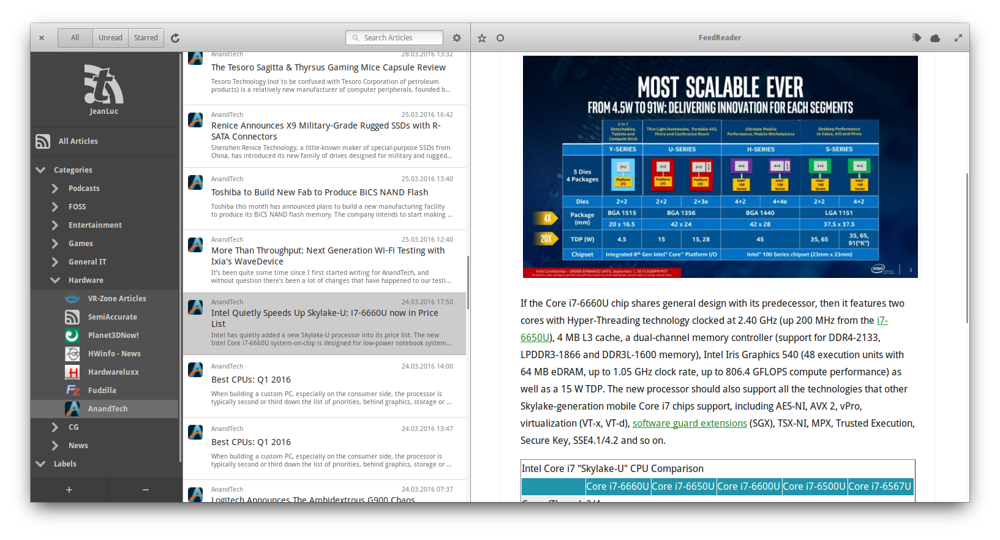

# FeedReader Website

FeedReader is a modern desktop application designed to complement existing web-based RSS accounts. It combines all the advantages of web based services like synchronisation across all your devices with everything you expect from a modern desktop application.

**NOTE:** This is the code for the [website](http://jangernert.github.io/FeedReader/) of the FeedReader project.

## Credits

Built using [Readable Bootstrap theme](http://bootswatch.com/readable/) from [Bootswatch](http://bootswatch.com/).
